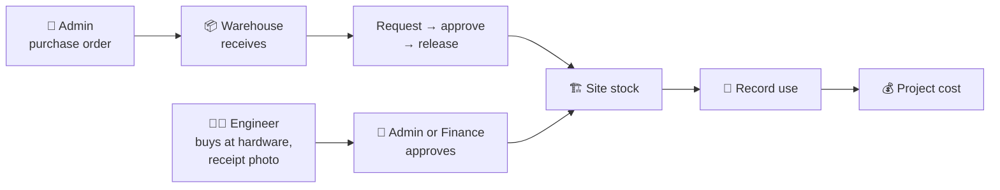
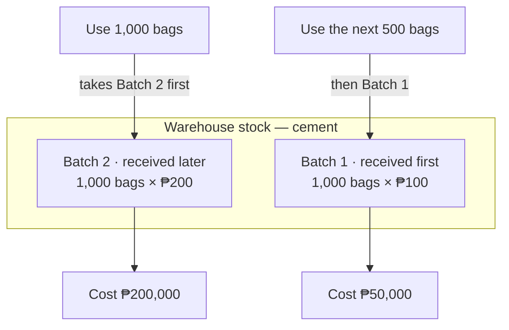
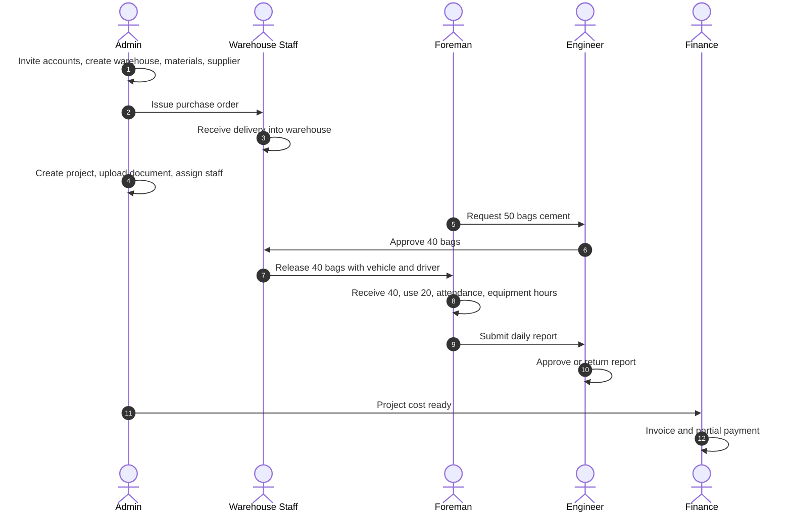

# Nognog ERP — Testing Guide

This guide shows what each account can do and walks through one complete project, from buying materials to billing the client. Use test projects and test stock during this round, not real company records.

- **Web app:** every role
- **Mobile app (Android / iOS):** Foreman and Engineer

---

## Three ways material moves

| # | When | Steps | Who |
|---|---|---|---|
| **1. Buy for the warehouse** | Bulk order from a supplier | Purchase → receive at warehouse → pay | Admin buys, Warehouse Staff receive, Finance or Admin pays |
| **2. Take from the warehouse** | The site needs stock the warehouse has | Request → approve → release (truck, driver) → receive at site | Foreman or Engineer requests, Engineer approves, Warehouse Staff release, site receives |
| **3. Buy at the hardware store** | The Engineer buys directly for the site | Record the purchase with the receipt photo → Admin or Finance approves → stock is added at the site | Engineer, then Admin or Finance |

All three end the same way: the Foreman or Engineer **records what was used at the site**, and that is when the project is charged.

A request only lists materials that are in stock. If an item is not in inventory at all, the Foreman or Engineer reports it to Admin, who adds it.

---

## What each account can do

Admin invites everyone from **Users**. Engineers and Foremen only see projects they are assigned to. Warehouse Staff only see warehouses they are assigned to. Laborers are employee records and do not log in.

### Access at a glance

| Task | Admin | Finance | Engineer | Foreman | Warehouse Staff |
|---|:---:|:---:|:---:|:---:|:---:|
| Invite users, set roles | ✅ | — | — | — | — |
| Create projects, sites, budgets | ✅ | — | — | — | — |
| Upload, rename and delete project documents | ✅ | — | — | — | — |
| View and download project documents | ✅ | — | ✅ | ✅ | — |
| Add suppliers, issue purchase orders | ✅ | — | — | — | — |
| View purchase orders, suppliers and prices | ✅ | ✅ | — | — | — |
| Record supplier payments (cash or check) | ✅ | ✅ | — | — | — |
| Void a supplier payment | ✅ | — | — | — | — |
| Buy at a hardware store for the site (with receipt photo) | ✅ | — | ✅ | — | — |
| Approve or reject a site purchase; mark it reimbursed | ✅ | ✅ | — | — | — |
| Receive deliveries for a purchase order Admin issued | ✅ | — | — | — | ✅ |
| Add stock without a purchase order | ✅ | — | — | — | — |
| Request materials (in-stock only) | — | — | ✅ | ✅ | — |
| Report a missing material | — | — | ✅ | ✅ | — |
| Approve material requests | ✅ | — | ✅ | — | — |
| Release approved materials to site | ✅ | — | — | — | ✅ |
| Receive materials at site | ✅ | — | ✅ | ✅ | — |
| Record materials used | ✅ | — | ✅ | ✅ | — |
| Record attendance, equipment hours (with photos) | ✅ | — | — | ✅ | — |
| Submit daily report | ✅ | — | ✅ | ✅ | — |
| Review daily report | ✅ | — | ✅ | — | — |
| See project costs, profit and loss | ✅ | ✅ | — | — | — |
| See material price batches | ✅ | ✅ | — | — | — |
| See stock value and movement costs | ✅ | ✅ | — | — | — |
| Issue invoices, record payments | ✅ | ✅ | — | — | — |
| Void invoices, reverse payments | ✅ | — | — | — | — |
| Audit logs | ✅ | — | — | — | — |

### 🛡️ Admin — owner / office manager
Web · all projects and warehouses

- **People:** invite Engineer, Foreman, Warehouse Staff and Finance accounts; deactivate accounts; add employees and labor rates; assign staff to projects and warehouses.
- **Projects:** create, edit and archive projects and sites; upload, rename and delete documents on the **Documents** page (each project's Documents tab is view and download only); set each site's Engineer and Foreman on the project's **Sites** tab; add workers in **Labour → Manage workers**; adjust budget; post other expenses; set equipment rates; reverse wrong entries with a reason.
- **Inventory and purchasing:** add warehouses, materials, equipment and vehicles; add suppliers and prices; issue purchase orders; receive deliveries, including at a changed price with a reason; print QR labels.
- **Approvals:** approve or reject any material request; resolve missing-material reports; approve, hand over and take back equipment; approve stock-count shortages.
- **Money:** invoices and payments; void invoices and reverse payments (Admin only); profit and loss; PDF and Excel export.
- **Oversight:** dashboard across all projects; daily reports; audit logs.

### 💼 Finance — financing department
Web · all projects, read-mostly

- **Can:** see dashboard totals and costs for every project (materials, labor, equipment, other expenses, budget), including cost per material; view purchase orders, suppliers and price history; see stock at every location with its value, cost per stock movement and material price batches; export inventory with values; see labor rates and attendance cost; approve or reject site purchases and mark them reimbursed; view equipment photos; issue client invoices; record client payments; export profit and loss.
- **Cannot:** create or change purchase orders, suppliers or prices; receive deliveries or move stock; change budgets or rates; void invoices or reverse payments; manage users.

### 🧑‍💼 Engineer — site engineer
Web and mobile · assigned projects only

- **Can:** approve, partly approve or reject the Foreman's material requests; request in-stock materials; report a missing material; receive deliveries at site with a quality note; record materials used; review daily reports (approve or return); record project progress; **record purchases made at a hardware store** with the receipt photo (web or phone); request equipment; count site stock; download project documents; scan QR codes.
- **Cannot:** approve their own request or site purchase; request items not in inventory; see wages or rates; see other projects.

### 👷 Foreman — on site daily
Mobile (main) and web · assigned projects only

- **Can:** request in-stock materials; report a missing material; receive deliveries with quantity and quality note; record materials used today; record workers present; record equipment hours with start and after photos; create and submit the daily report; request equipment; count site stock; download project documents; scan QR codes.
- **Cannot:** approve requests; see wages, rates or costs; edit a report after submitting unless the Engineer returns it; see other projects.

### 📦 Warehouse Staff — warehouse keeper
Web · assigned warehouses only

- **Can:** see stock in their warehouse; **receive supplier deliveries** from **Receive deliveries** once Admin has issued the purchase order (count what arrived; the price comes from the purchase order); release approved requests with vehicle, driver and reference; send and receive transfers; count warehouse stock; scan QR codes.
- **Cannot:** add stock without an Admin-issued purchase order; see or change prices; release anything that is not approved; see costs, suppliers or billing; see other warehouses.

---

## How material cost is calculated

Each delivery is a **batch** with its own price. When material is used, the **newest batch is used first**. When it runs out, the next newest is used.

- The project is charged when material is **used at site**, not when it is requested or released.
- A new purchase never changes costs that were already recorded.
- Admin and Finance can see each material's batches on its material page under **Price batches**.

---

## Test script — one full project, start to finish

Prepare one test account per role. Run the steps in order; each step needs the one before it.

| Role | Test account |
|---|---|
| Admin | admin@nognog.local |
| Finance | finance@nognog.local |
| Engineer | engineer@nognog.local |
| Foreman | foreman@nognog.local |
| Warehouse Staff | warehouse@nognog.local |

Passwords are shared separately, not in this guide.

| # | Account | What to do | What to check |
|---|---|---|---|
| 1 | Admin | Invite Engineer, Foreman, Warehouse Staff and Finance. Create a warehouse and assign Warehouse Staff to it. | Each person gets an email and can set a password. |
| 2 | Admin | Add materials (e.g. Rebars and Cemento, pcs), one equipment item and one vehicle. Add a supplier with only its name, address and contact number (e.g. VIC Hardware). | They appear in Inventory and Suppliers. The supplier gets a code automatically. |
| 3 | Admin | In **Purchases**, submit VIC Hardware, deliver to the warehouse, Rebars 1,000 × ₱100 and Cemento 2,500 × ₱250. | The ₱725,000 purchase waits for owner approval. There is no purchase order, supplier-price update or stock posting yet. A purchase of exactly ₱50,000 issues immediately; one above that does not. |
| 3-owner | Admin acting as owner | Open **Waiting for owner approval**, review the supplier, warehouse, items and total, then approve. Also try rejecting a separate request with a reason. | Approval issues the purchase order once and updates the supplier's latest prices. Rejection issues nothing. Finance cannot approve. |
| 3-quote | Admin, then Finance | Open **Purchases → Compare quotations**, record two suppliers' dated offers for the same material, and filter by that material. Use one quotation to start a purchase. | Quotes appear beside each other with price, supplier and validity. Saving a quote alone does not update purchased-price history or inventory. A purchase linked to a quote must match its supplier, items, quantities and prices. Finance can compare but cannot record a quote. |
| 3-request | Admin | Open an Engineer-approved material request and choose **Purchase for request**, then buy only its listed materials for its source warehouse. Also create a normal warehouse-restocking PO without a request. | The PO/owner approval retains the request link. A pending request, mismatched warehouse or material is refused. Receiving into the warehouse does not automatically deliver to the site or consume the material. |
| 3a | Finance | On **Purchasing by Supplier**, use the pencil beside **Supplier Payment** (or open the purchase’s **Supplier Payment** section): Check, Metrobank, check no. 123456, ₱725,000, dated Dec 15, 2026. | The purchase shows Fully paid; the check shows Postdated. The supplier's **Supplier history** lists the check. Finance cannot void it; Admin can. |
| 3b | Admin or Finance | Open **Purchases** (the main purchasing screen). | The summary shows items bought, total value (and what is still to pay), suppliers and items received. Each item shows its supplier, contact, payment terms, price, total, location and workflow stage. Received PO items show **Supplier Payment**, with Received · Unpaid/Partly paid/Paid beneath it. Its pencil opens the whole-order payment form; a paid order opens payment history. Admin’s outstanding-delivery action opens the inspection and receipt section; Finance cannot receive. Site purchase review opens its receipt detail before approval. Column headings are 14px and left-aligned. Site purchases appear in the same list. |
| 4 | Warehouse Staff | Open **Receive deliveries**, inspect the supplier delivery with a reference, delivered and accepted quantities and a note if any were rejected. Then choose **Add accepted stock**. Try posting a receipt before inspection. | Uninspected receipts are refused on new POs. Only accepted quantity enters warehouse stock, once; rejected quantity does not. No price is shown to Warehouse Staff. |
| 5 | Admin | Create a project. In its **Sites** tab, add a site by choosing only the Engineer and Foreman (the site takes the project's name and address). On the **Documents** page, upload a file for that project with a name you type. In **Labour → Manage workers**, add two employees with labor rates. | The site shows its Engineer and Foreman, and they can be changed with **Save staff**. The project's Documents tab lists the file with View and Download only. The Labour tab shows the labour distribution and worker list. |
| 6 | Foreman (phone) | Request 50 bags of cement. Try to find an item that is not in stock and report it as missing. | Only in-stock items can be requested. Admin sees the missing-item report. |
| 7 | Engineer (phone) | Approve 40 of the 50 bags. | The Foreman cannot approve. |
| 8 | Warehouse Staff | Release the 40 bags with vehicle, driver and delivery reference. | The request shows as released. |
| 9 | Foreman (phone) | Receive 40 bags with a quality note. Record 20 bags used. Record attendance and equipment hours with two photos. | Site stock shows 20 left. |
| 9a | Engineer (phone or web) | Open **Buy at hardware store / Site purchases**. Choose the site, pick **+ New store** and enter Ace Hardware with its address and contact number, receipt no. OR-1001, Cemento 10 bag × ₱260, paid with **Own money**, and take a photo of the receipt. Submit. | The purchase shows Waiting approval. Submitting the same receipt again is refused. |
| 9b | Finance | Open **Site purchases**, open the purchase, check the receipt photo, **Approve**. Then **Mark reimbursed** with reference PCV-0001. | Site stock goes up by 10 bags. The material page's **Price batches** shows the ₱260 batch from Ace Hardware at the site. |
| 10 | Foreman, then Engineer | Foreman creates and submits today's daily report. Engineer approves or returns it. | The report shows the day's material use, workers and equipment. |
| 11 | Admin or Finance | Open the project's **Finance** tab. | Only the 20 bags used are charged, plus labor and equipment. |
| 12 | Finance | Issue an invoice and record a partial payment. | Finance cannot void it; Admin can. |
| 13 | Admin | Receive 10 bags at ₱100, then 10 bags at ₱200. Release and use 10 at the site. | The use costs ₱2,000 (the newer batch). The material page shows the ₱100 batch as used next. |
| 14 | Admin | Add a new purchase from the same supplier with a different price (e.g. Cemento at ₱260). | A purchase above ₱50,000 changes the latest supplier price only after owner approval. Yesterday's posted project cost does not change. Audit logs show the request and decision. |

Also try each account on a project or warehouse it is **not** assigned to: it should not appear.
