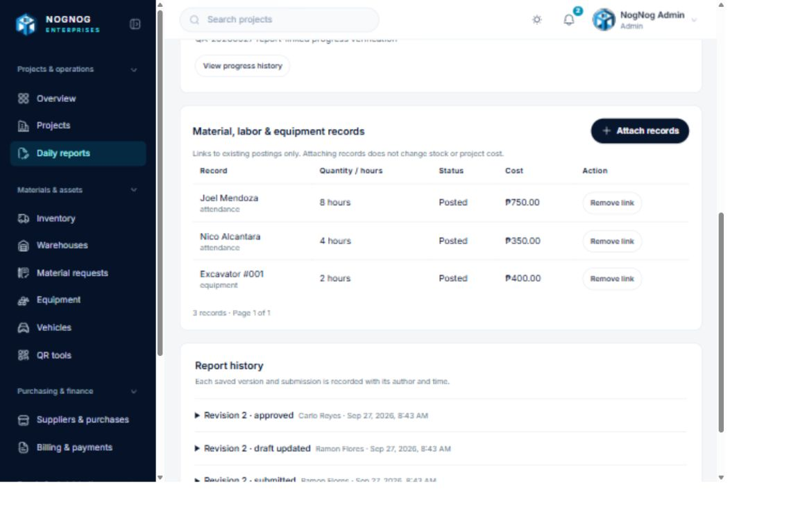

# Six-gap implementation and acceptance record

Status: partially verified, **not operationally accepted**. The initial code review made no hosted changes. Subsequent explicitly authorized staging QA created labeled business records; no hosted schema, migration history or deployment was changed. Preserve the four roles, existing material approvals, modal attendance entry, Cards/Table selection and cached navigation. Native apps, payroll expansion and new approval queues are excluded.

## Implementation

1. New material forms and database writes accept consumables only. Reusable tools belong in the existing Equipment registry/handover workflow. Existing reusable material rows cannot be edited, converted or posted; their history and balances remain intact. Admin must reconcile them deliberately before creating any corresponding equipment record.
2. Assigned Foremen and Admin can post attendance without approval. The command keeps atomic historical rate/cost snapshots, retry keys, duplicate prevention and employee-level locking for the 24-hour limit. Daily entry accepts full/half days; hourly entry costs actual hours. An ambiguous effective rate requires an Admin-maintained costing basis. Foremen cannot configure basis/rates or reverse attendance. Their operational RPC returns no wage/cost fields. Saves no longer redirect. Project assignment is the existing authorization boundary; employee assignment carries and validates the site relationship.
3. Reports attach existing consumption/attendance/equipment postings through typed foreign keys. Project/date/known site must match. New equipment postings snapshot their site; unknown historical sites are not invented. Attachment/removal is audited, including after submission. Duplicate links are prevented. A linked report cannot change its project/date/site until links are removed. Reversed postings remain visible and excluded from displayed financial values. No linking command posts stock or costs; profitability stays authoritative in its existing ledger RPC.
4. Notification repair now has version `20260926110100`; common units retain `20260926110000`. Forward repair `20260927080000` idempotently ensures both changes exist. The migration-version validator rejects duplicate filenames.
5. Reservation/concurrency scripts use generated four-role users and random credentials. They require a local Docker socket, reject remote Supabase URLs, clone the verified local database into an exact generated test-owned database, and clean up only that clone. No company reset is performed. Concurrent release exercises an approved request line rather than direct stock-out. A new attendance/report-link integration script covers daily full/half-day and hourly costing, ambiguous basis, retries, concurrent duplicate/role/wage/cross-project denial, financial redaction, link idempotency/no double posting and Admin reversal.
6. Inventory balances filter/page in SQL; inventory export reads all matching records in server batches. Attendance, progress, project equipment/expenses/budget history, supplier events/purchases/prices, equipment/vehicle events and equipment usage have stable independent pages and counts. Stock counts have separate stock/history pages and scoped pending-count detection. Project totals remain ledger aggregates, not page sums. Material request/stock-in/site-use and attendance assignment pickers now support paginated searches and keep choices cached while their form is open.

## Verified code checks

- [x] ESLint.
- [x] TypeScript.
- [x] Production build.
- [x] 52 domain, security, navigation/cache, media, export and rendering unit tests.
- [x] Migration filename validation: 60 unique versions.
- [x] SQL statement syntax parsed for six new migrations using PostgreSQL's parser (pglast). This does not validate PL/pgSQL catalog resolution, column types, RLS, grants or execution.

## Unverified acceptance / remaining implementation

- [ ] Complete clean-database migration chain and both duplicate-version repair states.
- [ ] Hosted migration history inspection and hosted behavior. No database reset or migration-history repair is authorized by these code checks.
- [ ] Four-role end-to-end purchase → receipt → request/approval → release/receipt → consumption → labor/equipment → report → billing/payment → profitability reconciliation.
- [ ] Cross-project/site denial, Foreman wage denial, ambiguous historical rates, hourly/full-day costing, concurrent attendance/24-hour enforcement and historical fractions in a database.
- [ ] Resource-link material/equipment cases, unauthorized attachment/removal and submitted-report audit behavior in a database.
- [ ] More than 1,000 balances, complete exports, all page counts and reversed-record totals reconciled in a database.
- [ ] Finish remaining capped reference loaders and auxiliary histories: inventory location/category/unit references, supplier catalog/comparison/reference loaders, project equipment reference loader, material catalog/details, inventory transfer and opening-value queues. They are not covered by the selected pagination work above. Do not claim complete pagination yet.
- [ ] Finish the remaining integration matrix (cross-project 24-hour sums, material/equipment attachments, complete HTTP exports and full purchase-to-profitability workflow). Attendance and >1,000 SQL balance test scripts are written but unexecuted; they are not passing evidence.
- [ ] Browser walkthrough with all four roles, modal/accessibility/narrow-screen behavior and silent save refresh.

Local execution blocker: `npm run supabase:start` failed while Docker committed its overlayfs metadata (`metadata.db: input/output error`). The attendance integration script subsequently failed at container inspection with Docker's 500 server error, before creating a test database or posting any ERP records. Fix the Docker engine/storage first. No destructive cleanup of Docker volumes was attempted.

## Safe migration reconciliation

Before any hosted rollout, inspect the ledger read-only:

```sql
select version, name from supabase_migrations.schema_migrations
where version in ('20260926110000','20260926110100','20260927080000')
order by version;
```

Inspect whether both common units and notification repair are actually present. A filename collision may have recorded either original file at `20260926110000`; do not infer which from the version alone. The new notification repair and forward repair are repeat-safe, so apply the ordered unapplied migrations using the normal reviewed migration process. Do not reset a hosted database, delete ledger rows or blindly mark migrations applied. Retain the existing common-units version.

For local acceptance, start a healthy Supabase test database, apply the complete ordered chain, then run `npm run test:migrations`, `npm run test:automatic-attendance`, `npm run test:inventory-pagination`, `npm run test:material-reservations` and `npm run test:inventory-concurrency`. The latter scripts create disposable copies, but they depend on a fully migrated, seeded local database. Database acceptance remains unchecked until actual results and financial reconciliation are recorded here.

## Follow-up implementation and verification (2026-09-27)

- Equipment CSV now traverses every filtered asset page instead of exporting only 500. Transfer history has a count and stable 25-row pages. Supplier comparison and purchasing choices, report choices/history, employee categories/events/rates/assignments, project attendance assignment choices and project equipment rate lookups now traverse ordered pages rather than silently stopping at their previous caps. Project equipment choices share one site-scoped loader. This is code-level coverage, **not** a populated-database or HTTP-export acceptance result. Some material, billing and auxiliary reference paths still need a dedicated large-data audit; do not claim all lists fully paginated.
- Migration `20260927140000` rejects new attendance at a nonoperational project/site or for an inactive employee while preserving existing posted history. It also publishes RLS-selectable project attendance/cost/billing/report-link tables as Realtime invalidation sources. Cost-bearing RLS remains Admin-only; non-Admin project and attendance views also use a 90-second silent refresh to catch changes that Realtime cannot disclose safely.
- Migration `20260927150000` permits assigned Foremen to record equipment hours at an active project site through the atomic rate-snapshot RPC. The rate is selected server-side; Foremen cannot set it or reverse costs. The Foreman form does not display rates or costs. The user reports applying this and the attendance/Realtime migration; their hosted migration ledger and role-specific behavior remain unverified.
- Read-only authenticated Admin walkthrough of the hosted dashboard, projects/detail/costs/attendance, inventory/transfers/transactions, equipment, requests, attendance, suppliers, purchasing, billing, reports, audit logs, warehouses and vehicles rendered without an immediate page error. Seeded records had no posted labor/equipment/billing/request activity for a meaningful cost reconciliation. No hosted write, seed, schema change, deployment or role switch was performed.
- Local checks passed: `npm run typecheck`, `npm run lint`, `npm run test:all` (55/55), `npm run test:migrations` (62 unique versions), `npm run build`, and PostgreSQL syntax parsing of the two new SQL files. Syntax parsing does not execute triggers or resolve catalog objects. `npm run test:automatic-attendance` could not enter the isolated test database because `docker inspect supabase_db_nognog-enterprises` timed out. Thus RLS, triggers, role denial, Realtime delivery, concurrent release and financial totals remain unverified. The new migrations must be reviewed/applied to an isolated database before hosted rollout; do not run destructive fixtures against company data.

## Authorized hosted four-role QA (later on 2026-09-27)

Environment: the user explicitly identified the Vercel/Supabase environment as staging and authorized record creation and all four supplied accounts. Tests used authenticated public-key clients and browser sessions, never a service-role key. `QA-20260927` labels distinguish test records. Earlier "unverified" statements above describe the initial review, not these later results. Business acceptance checkboxes remain unchecked because the complete stock/financial workflow still fails.

### Verified scenarios

| Area | Executed result |
|---|---|
| Four accounts / isolation | Admin, Engineer, Foreman and Warehouse Staff authenticated. An unassigned project returned no rows and a 404 for Foreman. Engineer/Warehouse attendance mutations and non-Admin profitability/rate changes were denied. Foreman costing-basis changes were denied. Financial attendance rows were hidden from non-Admins. |
| Request / reservation / release | Foreman created MR-00000001 for 10 cement bags; Engineer approved 10. Source stock changed from 100 on hand / 0 reserved to 100 / 10, available 90. Warehouse request visibility failed (below), so Admin performed the explicitly labeled fallback release: 90 on hand / 0 reserved / 10 in transit. This is not a passing four-role fulfillment test. |
| Attendance | Foreman modal saved Joel's full day (8 hours, PHP 750) and Nico's half day (4 hours, PHP 350) without approval. Duplicate attendance and 25 hours were rejected. Two simultaneous submissions produced one posting; same-key retry returned the same ID. Admin reversal restored the ledger; Foreman reversal was denied. Pre-assignment dates and unknown assignment IDs were rejected. |
| Equipment | Foreman requested EQ-EXC-001; Admin approved/checked it out. Foreman posted 2 hours, snapshotted the CTU site and PHP 200/hour rate, costing PHP 400. Same-key retry did not duplicate usage; Foreman rate changes were denied. Admin returned the asset to its original location, available. |
| Reports / progress | DR-1 links two attendance entries and the 2-hour equipment entry. Duplicate links did not increase ledger costs. Incorrect-date links and Warehouse attachments were denied. Foreman resource results omitted costs. Report submitted and independently approved by Engineer; self-review denied. UI clamps 101% to 100%; a labeled 2% update saved and appeared linked to DR-1. |
| Purchasing / price history | An isolated QA supplier/catalog stores PHP 100 on Sep 26 and PHP 120 from Sep 27. PO-2026-000001 ordered on Sep 26 preserved the PHP 100 price ID. Same-key issue/receipt retries were idempotent. Two partial receipts added 2 bags and PHP 200 of receipt cost, completing the PO. Excess receipt rejected. Purchasing did not create a project consumption expense. Independent valuation-table access failed (below), so full valuation reconciliation is not accepted. |
| Billing / money | Test invoice PHP 1,000, payment PHP 400, receivable PHP 600. Same-key retries returned the same records; PHP 601 excess payment rejected. Labor PHP 1,100 + equipment PHP 400 = project posted cost PHP 1,500; report linking did not add cost. Material cost remains zero because site receipt/consumption are blocked. |
| Realtime / privacy | An inserted Foreman report delivered a Postgres Changes event to assigned Engineer. New attendance delivered an event to Admin and no financial event to Foreman. Test attendance was reversed afterward and total cost returned to PHP 1,500. This verifies those sources, not every subscription/reconnect scenario. |
| Small-data pagination / UI | Resource and attendance-reference page size 1 produced distinct, stable pages and complete counts; negative offsets and unassigned-project picker access were denied. Project Cards/Table switching worked with thumbnail/fullscreen viewing of an existing persisted photo. Add project remained a dialog. New upload could not be exercised because both documented browser file-chooser attempts timed out; the unsaved form was canceled. |
| Exports / local checks | Admin PDF/XLSX downloads succeeded, but file contents/large filtered exports are not reconciled. Re-ran 55 unit tests and 62-version migration validation successfully; QA script syntax and ESLint passed. No production-code change required a new build in this QA-only pass. |

### Confirmed failures / release blockers

1. **Warehouse Staff cannot read the approved request for its source warehouse.** Authenticated SELECT returns zero rows; list is empty and request detail is 404. Request SELECT uses project-only `private.can_view_material_request_project` in `20260924180000_material_request_intake.sql`, excluding Warehouse Staff. Do not solve this by granting warehouse users unrestricted project or financial access. Recheck both request and child-row scope when repaired.
2. **Foreman site receipt fails atomically with PostgreSQL 42804.** `receive_request_transfer` reports `column "status" is of type public.transfer_status but expression is of type text`. The retained request-receipt function in `20260924190000_request_fulfillment.sql:306` assigns an untyped CASE to the enum. Refresh confirmed received 0 / in transit 10: no partial stock commit. The complete request → site receipt → consumption → material costing chain is blocked.
3. **Authenticated Admin valuation SELECT fails with 42501:** `permission denied for function can_manage_inventory`. The `inventory_valuations_select` policy calls this helper, while the original inventory migration revokes its execution from authenticated. Actual purchase receipt succeeds through its security-definer command; it is incorrect to describe purchasing itself as failing. The valuation read and its dependent authenticated loaders still require repair/verification.

Other observed UX issues: failed attendance submissions cleared entered selections/notes; request copy still mentions "manager"; Warehouse direct finance navigation renders a generic error boundary rather than a friendly forbidden screen (no financial rows disclosed). A captured React #441 console entry corresponds to that denied route, not proof of a new Admin page failure.

### Remaining unverified — not marked accepted

- Clean migration-chain execution, hosted migration ledger and both duplicate-version repair states.
- Active/inactive/archived project/site/employee combinations; hourly and ambiguous-rate scenarios; cross-project aggregate 24-hour enforcement; historical fraction preservation.
- Receipt/consumption, consumption reversal and material report links; two simultaneous approved releases; two-warehouse and full quantity/value reconciliation.
- More than 1,000 stock rows, all auxiliary histories/reference lists, full filtered exports and PDF/XLSX content/layout reconciliation.
- New image upload persistence, QR camera/manual workflow, low-stock worker delivery, reconnect/session-change behavior, comprehensive mobile-width/accessibility and navigation timing.
- Full purchasing-to-profitability acceptance including all cost categories and reversals. **Do not certify the web ERP complete.**

### Test-owned records retained

Keep posted history intact; no company reset or hard delete occurred. MR-00000001/TRF-00000001 retain 10 bags in transit pending the receipt repair. PO-2026-000001 retains two received bags (Main Warehouse now 92 on hand), QA supplier/category/catalog and price versions. DR-1 is approved with three resource links and the 2% progress update; DR-2 is a Realtime-test draft. The equipment request is returned; its PHP 400 usage and PHP 200/hour test rate remain. The test invoice/payment remain labeled; concurrent/Realtime test attendance was reversed, not deleted. Joel/Nico's PHP 1,100 attendance remains to reconcile DR-1. These staging effects must not be mistaken for real company transactions.

The hosted QA runner used for this historical pass has been retired after the staging checks completed; it depended on fixed IDs and included one-time repair/receipt branches. The executed results and retained QA data are documented above. The separate repeatable local test suites remain under `scripts/` and are wired to package commands.



## Repair of the three hosted QA blockers

Implemented locally after the hosted QA above:

- `20260927160000_repair_request_receipt_access.sql` grants Warehouse Staff read access to approved/partially approved requests only when assigned to their source warehouse. Child records reuse the existing scoped helper. Pending requests and unassigned warehouses stay hidden; project-finance access is unchanged.
- A bounded, authenticated `get_material_request_context` RPC returns only authorized request destination IDs/names/code. List/detail loaders use it instead of directly querying project/site records that Warehouse Staff cannot read. The list retains pagination and adds an ID tie-breaker; one context request replaces two reference queries.
- Both retained receipt implementations cast their status CASE branches to `public.transfer_status`. Existing public valuation/variance wrappers, row locks, authorization, stock ledger writes and retry keys remain in place. Private posting implementations remain inaccessible to authenticated callers.
- Authenticated users can execute the Admin-capability boolean `private.can_manage_inventory`, as required by existing RLS policies. Its decision is unchanged; this does not grant inventory administration to other roles.
- The isolated `test:material-reservations` regression now applies the repair twice in its disposable local clone and covers Warehouse visibility/assignment revocation, hidden project details, bounded context inputs, Admin valuation reads, denied Warehouse site receipts, partial/full receipts, duplicate retries, excess receipts, partial/full returns and quantity/value preservation. These added database assertions have **not executed successfully yet**.

Verification: TypeScript, ESLint, all 55 unit tests, production build and 63 unique migration versions passed. PostgreSQL SQL/PL-pgSQL syntax parsing passed; parsing does not execute RLS, triggers or commands. The database regression failed before creating its fixture because Docker Desktop's Linux engine pipe was unavailable. No hosted schema change, deployment, stock receipt or push was performed in this repair turn. Do not change broad acceptance checkboxes based on these static results.

Required next steps:

1. Confirm the target is the authorized staging Supabase project, with preceding migrations applied. Run the **entire** new migration in the SQL editor; do not reset the database or replay seeds. Keep the normal database backup/recovery procedure available.
2. Deploy the accompanying typed request-loader changes only after SQL succeeds. A deployment using the new loader against the old database will lack the new context RPC.
3. Rerun staging Warehouse list/detail/release, Foreman receipt/consumption, Admin valuation reads and financial reconciliation. The existing QA transfer still contains 10 bags in transit; do not create another dispatch to work around it.
4. When Docker is available, run `npm run test:material-reservations` and `npm run test:inventory-concurrency` against the verified local database. Full migration-chain and operational acceptance remain separate gates.

## Authorized staging retest after database repair

The user applied the repair migration in the authorized staging project. Four-account authenticated API QA then passed all five repair checks and all nine denial/pagination checks. No service key, database reset, seed replay, or deletes were used.

The tests confirmed scoped Warehouse access to the approved request and destination labels, no direct Warehouse project rows, denied non-Admin profitability, successful Admin valuation reads, Foreman site receipt with correct transfer status, six-bag material consumption, a PHP 800 project material-cost total across eight QA bags, idempotent report linking without a second cost posting, and a two-bag site return that preserved warehouse/site quantity and value. The extra two-bag request also confirmed that Warehouse Staff can dispatch from its warehouse but cannot receive directly at a project site; assigned Foreman receipt succeeded.

The records are labeled QA-20260927. They leave 94 cement bags / PHP 9,400 in Main Warehouse and 2 bags / PHP 200 at the CTU project site. Eight bags / PHP 800 are posted as project consumption. The full user-visible request list/detail change is still local and needs deployment before browser verification.
